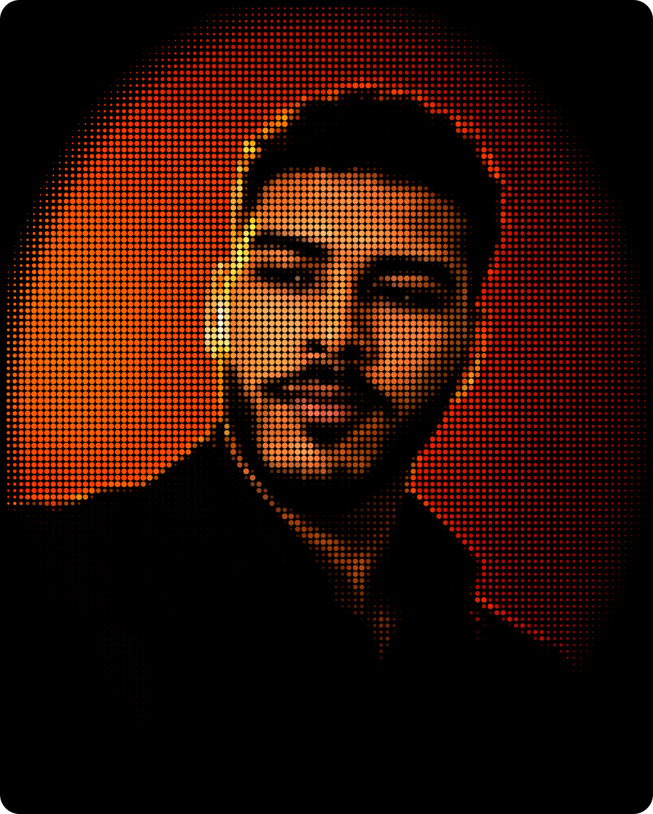
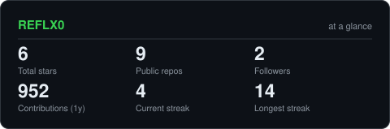
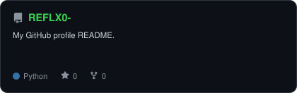

<div align="center">

<!-- PORTRAIT - generated by scripts/dotify.py from assets/jacket.png.
     Colour mode, so one file serves both GitHub themes. Regenerate with:
       python scripts/dotify.py assets/jacket.png -o assets/portrait \
         --cols 100 --equalize --detail 0.5 --color -->


<br>

<!-- NAME / TAGLINE - animated typing -->
<a href="https://github.com/REFLX0">
  
</a>

<br>

<!-- SOCIALS -->
<a href="https://linkedin.com/in/aziz-jlassi111"></a>
<a href="mailto:azizzizoujlassi@gmail.com"></a>
<a href="https://www.mohamedazizjlassi.me"></a>


</div>

---

## `~/` whoami

```console
$ cat about.txt
```

Hi, I'm **Mohamed Aziz Jlassi**, an AI & Robotics Engineer specializing in Artificial Intelligence, Computer Vision, Autonomous Systems, Robotics, and Embedded AI.

-  **Autonomous Systems & Robotics:** Built a complete autonomous drone from both hardware and software, integrating ROS2, PX4, YOLO, OpenCV, Python, and C++ for perception, navigation, mission planning, and autonomous flight.
-  **AI & Computer Vision:** Experienced in developing real-world AI systems using YOLO, Deep Learning, TensorFlow, PyTorch, MobileNetV2, ArcFace, DeepFace, OpenCV, and ONNX, from model development and training to real-time inference and deployment.
- ** **Full-Stack Development:** Proficient in building robust end-to-end applications and web services to integrate and deploy AI and robotics solutions.

- 🌐 Portfolio: **[www.mohamedazizjlassi.me](https://www.mohamedazizjlassi.me)**

<br>

<div align="center">

## `~/` toolbox


</div>

---

<div align="center">

## `~/` skill radar

<table>
<tr>
<td width="50%" align="center" valign="middle">

<!-- Self-rated radar - edit assets/skills.json, the workflow redraws it -->
<picture>
  <source media="(prefers-color-scheme: dark)"  srcset="assets/radar-dark.svg">
  <source media="(prefers-color-scheme: light)" srcset="assets/radar-light.svg">
  
</picture>

</td>
<td width="50%" align="center" valign="middle">

<!-- Live radar built from real language byte counts across your repos -->
<picture>
  <source media="(prefers-color-scheme: dark)"  srcset="assets/radar-langs-dark.svg">
  <source media="(prefers-color-scheme: light)" srcset="assets/radar-langs-light.svg">
  
</picture>

</td>
</tr>
</table>

</div>

---

<div align="center">

## `~/` contribution calendar

<!-- 3D isometric calendar, regenerated every 6h by .github/workflows/metrics.yml -->


<br><br>

<!-- Snake eats the contribution graph - .github/workflows/snake.yml -->
<picture>
  <source media="(prefers-color-scheme: dark)"  srcset="https://raw.githubusercontent.com/REFLX0/REFLX0/output/snake-dark.svg">
  <source media="(prefers-color-scheme: light)" srcset="https://raw.githubusercontent.com/REFLX0/REFLX0/output/snake.svg">
  
</picture>

</div>

---

<div align="center">

## `~/` the numbers

<!-- Generated by scripts/cards.py into this repo. Deliberately NOT
     github-readme-stats / streak-stats / github-profile-trophy: those are
     shared public instances that go down and take the whole section with them. -->
<picture>
  <source media="(prefers-color-scheme: dark)"  srcset="assets/card-stats-dark.svg">
  <source media="(prefers-color-scheme: light)" srcset="assets/card-stats-light.svg">
  
</picture>

<br>


<br><br>


</div>

---

<div align="center">

## `~/` selected work

<!-- Cards generated by scripts/cards.py from assets/projects.json.
     Stars, forks and language are pulled live from the API on every run. -->
<table>
<tr>
<td width="50%">
  <a href="https://github.com/REFLX0/autonomous-drone">
    <picture>
      <source media="(prefers-color-scheme: dark)"  srcset="assets/card-autonomous-drone-dark.svg">
      <source media="(prefers-color-scheme: light)" srcset="assets/card-autonomous-drone-light.svg">
      
    </picture>
  </a>
</td>
<td width="50%">
  <a href="https://github.com/REFLX0/vigilant-guard">
    <picture>
      <source media="(prefers-color-scheme: dark)"  srcset="assets/card-vigilant-guard-dark.svg">
      <source media="(prefers-color-scheme: light)" srcset="assets/card-vigilant-guard-light.svg">
      
    </picture>
  </a>
</td>
</tr>
<tr>
<td width="50%">
  <a href="https://github.com/REFLX0/cloud-automation">
    <picture>
      <source media="(prefers-color-scheme: dark)"  srcset="assets/card-cloud-automation-dark.svg">
      <source media="(prefers-color-scheme: light)" srcset="assets/card-cloud-automation-light.svg">
      
    </picture>
  </a>
</td>
<td width="50%">
  <a href="https://github.com/REFLX0/REFLX0-">
    <picture>
      <source media="(prefers-color-scheme: dark)"  srcset="assets/card-REFLX0--dark.svg">
      <source media="(prefers-color-scheme: light)" srcset="assets/card-REFLX0--light.svg">
      
    </picture>
  </a>
</td>
</tr>
</table>

<sub>

| project | live | stack |
|---|---|---|
| **[autonomous-drone](https://github.com/REFLX0/autonomous-drone)** | [GitHub](https://github.com/REFLX0/autonomous-drone) | `ROS2` `PX4` `OpenCV` |
| **[vigilant-guard](https://github.com/REFLX0/vigilant-guard)** | [GitHub](https://github.com/REFLX0/vigilant-guard) | `Python` `React` `TensorFlow` |
| **[cloud-automation](https://github.com/REFLX0/cloud-automation)** | [GitHub](https://github.com/REFLX0/cloud-automation) | `Terraform` `Docker` `Proxmox` |

</sub>

</div>

---

<div align="center">

<sub>`01110100 01101000 01100001 01101110 01101011 01110011 00100000 01100110 01101111 01110010 00100000 01110011 01100011 01110010 01101111 01101100 01101100 01101001 01101110 01100111`</sub>

</div>
